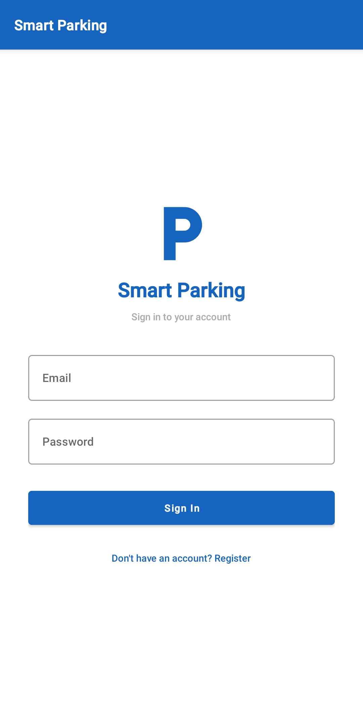
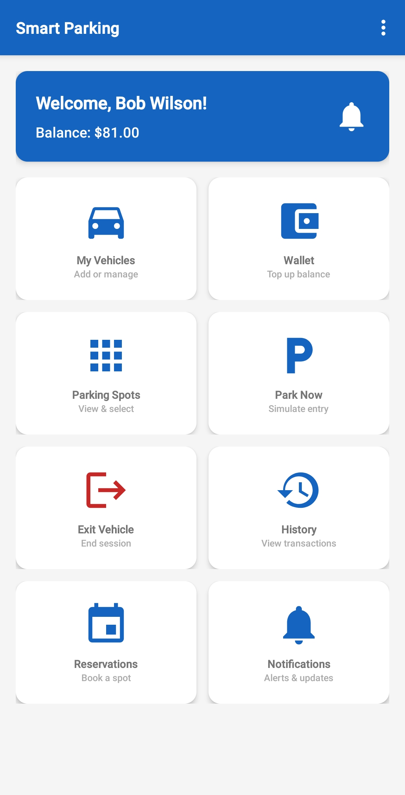
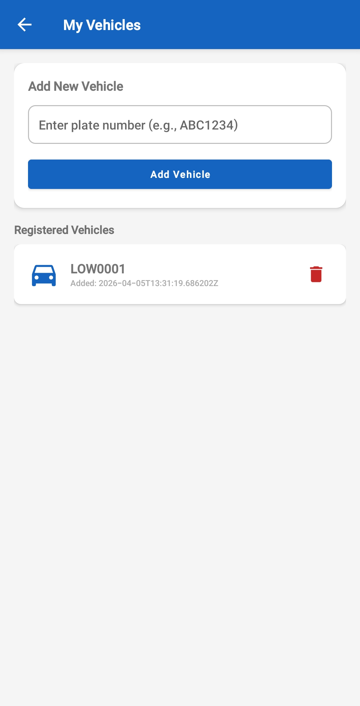
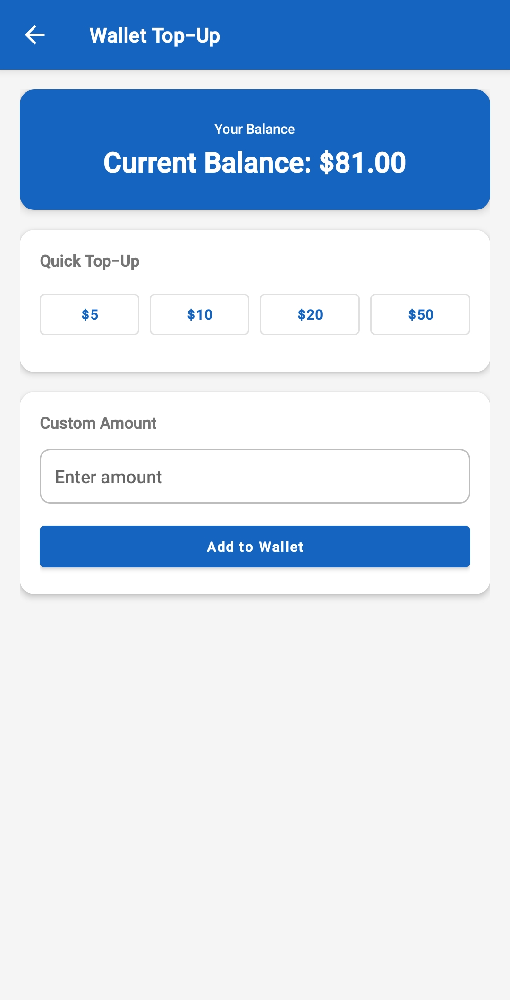
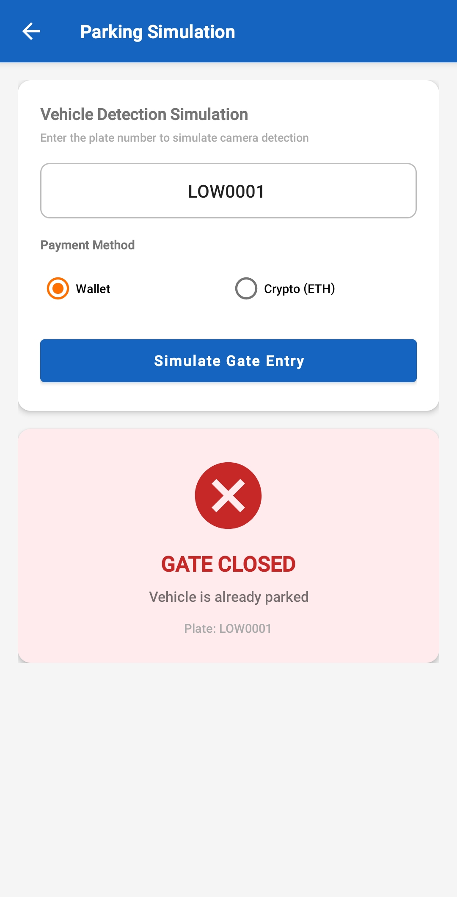

# Smart Parking & Automated Payment System

A complete IoT-integrated smart parking system featuring an Android mobile app, Django REST API backend, Arduino hardware simulation, and optional blockchain payments. The system handles vehicle detection, registration verification, duration-based billing, gate control, real-time spot monitoring, reservations, notifications, and admin management.

---

## Table of Contents

- [Overview](#overview)
- [Screenshots](#screenshots)
- [System Architecture](#system-architecture)
- [Features](#features)
- [Tech Stack](#tech-stack)
- [Project Structure](#project-structure)
- [Setup & Installation](#setup--installation)
- [API Documentation](#api-documentation)
- [Database Schema](#database-schema)
- [Arduino / Tinkercad Integration](#arduino--tinkercad-integration)
- [Smart Contract](#smart-contract)
- [Testing the System](#testing-the-system)
- [Contributors](#contributors)

---

## Overview

Traditional parking systems rely on manual ticketing and cash payments, leading to long queues and inefficiency. This project solves that by building a **smart parking system** combining mobile, web, IoT, and blockchain technologies:

1. A vehicle approaches the gate (detected by IR sensor or simulated via the app)
2. The system verifies the plate is registered to the user
3. The gate opens and the vehicle is assigned a parking spot
4. Duration-based billing is calculated at exit (first 30 minutes free)
5. The fee is deducted from the user's wallet or crypto balance
6. The gate opens for exit and the spot is freed
7. Every transaction is logged for history, notifications, and admin reporting

The system supports **20 parking spots** displayed in a real-time 4x5 grid, **reservations** with hold windows, **push notifications**, and an **admin dashboard** with revenue reports and gate override controls.

---

## Screenshots

| Login Screen | Main Dashboard | My Vehicles |
|:---:|:---:|:---:|
|  |  |  |

| Wallet Top-Up | Parking Simulation |
|:---:|:---:|
|  |  |

---

## System Architecture

```
┌──────────────────┐         HTTP/JSON          ┌──────────────────┐       Serial/USB       ┌──────────────────┐
│                  │  <───────────────────────>  │                  │  <──────────────────>  │                  │
│   Android App    │      REST API + JWT         │  Django Backend  │     OPEN/DENY/LCD      │  Arduino (IoT)   │
│   (Java)         │                             │  (Python)        │     IR/ULTRA/SPOT       │  Tinkercad Sim   │
│                  │                             │                  │                         │                  │
└──────────────────┘                             └────────┬─────────┘                        └──────────────────┘
                                                          │                                    Servo Gate
                                                ┌─────────┼──────────┐                         IR Sensor
                                                │         │          │                         LCD 16x2
                                                v         v          v                         LEDs + Buzzer
                                          ┌──────────┐ ┌──────┐ ┌──────────────┐              Ultrasonic Sensor
                                          │  SQLite   │ │ JWT  │ │  Blockchain  │
                                          │ Database  │ │ Auth │ │  (Hardhat)   │
                                          └──────────┘ └──────┘ └──────────────┘
```

---

## Features

### Mobile App (Android - Java)
- **User Authentication** - Register and login with email/password (JWT)
- **Vehicle Management** - Add, view, and delete registered vehicles
- **Wallet System** - View balance, quick top-up ($5/$10/$20/$50), or custom amount
- **Parking Spot Grid** - Real-time 4x5 visual grid showing free (green), occupied (red), and reserved (yellow) spots
- **Parking Entry** - Select a spot and simulate gate entry with plate number
- **Parking Exit** - View active session details (duration, estimated fee) and exit
- **Duration-Based Billing** - First 30 min free, then tiered pricing
- **Reservations** - Reserve a specific spot for a time window
- **Notifications** - Real-time notification feed with unread badge on home screen
- **Transaction History** - View all past entries, exits, and payments
- **Admin Dashboard** - Revenue reports, spot overview, parked vehicles list, gate override (admin users only)
- **Dual Payment** - Wallet or Crypto (ETH) payment methods

### Backend API (Django + DRF)
- **32+ RESTful API endpoints** across 9 Django apps
- **JWT Token Authentication** via SimpleJWT
- **Duration-Based Pricing** - 4-tier fee calculation at exit
- **20 Parking Spots** with real-time occupancy tracking
- **Reservation System** - 15-minute hold window with $1 expiry penalty
- **Notification System** - Auto-generated notifications for entry, exit, reservation events
- **Admin Dashboard APIs** - Revenue (today/week/month), parked vehicles, spot overview, gate override
- **IoT Serial Handler** - Bidirectional communication with Arduino via pyserial
- **Duplicate Entry Prevention** - Blocks rapid re-entries within 60 seconds
- **Input Validation** on all endpoints
- **Graceful Blockchain Fallback** - Crypto features disabled cleanly if Hardhat isn't running

### Arduino / IoT (Tinkercad Simulation)
- **Servo Motor** - Gate barrier that opens (90 degrees) and closes (0 degrees)
- **IR Sensor** - Detects vehicle arrival at the gate
- **16x2 LCD Display** - Shows system status, welcome messages, and error info
- **Green/Red LEDs** - Visual gate status indicators
- **Buzzer** - Audio feedback (success beeps, error buzzes)
- **Ultrasonic Sensor** - Measures distance to detect if a parking spot is occupied (<10cm = occupied)
- **Serial Protocol** - Commands: `OPEN`, `DENY`, `LCD:line1|line2`, `BUZZ:duration`, `STATUS`

### Blockchain (Solidity + Hardhat)
- **ParkingPayment Smart Contract** - On-chain deposit, payment, and balance tracking
- **Event Emission** - `Deposited`, `ParkingPaid`, `Withdrawn` events for transparency
- **Owner Controls** - Fee adjustment and fund withdrawal

---

## Tech Stack

| Layer | Technology |
|-------|-----------|
| **Mobile App** | Java, Android SDK 34, Retrofit 2, OkHttp, Gson, Material Design, CardView, GridLayout |
| **Backend** | Python 3, Django 4.2, Django REST Framework, SimpleJWT, pyserial, web3.py |
| **IoT / Hardware** | Arduino (C++), Servo, LiquidCrystal, IR Sensor, Ultrasonic Sensor, LEDs, Buzzer |
| **Blockchain** | Solidity 0.8.19, Hardhat, ethers.js |
| **Database** | SQLite (Django ORM) |
| **Authentication** | JSON Web Tokens (JWT), Django password hashing (PBKDF2) |

---

## Project Structure

```
project/
├── django_backend/                # Django REST API
│   ├── smart_parking/             # Project settings & URL routing
│   │   ├── settings.py
│   │   └── urls.py
│   ├── accounts/                  # User auth (register, login, custom User model)
│   │   ├── models.py              # Custom User with balance & is_parking_admin
│   │   ├── views.py               # register(), login() with JWT
│   │   └── serializers.py
│   ├── vehicles/                  # Vehicle CRUD
│   │   ├── models.py              # Vehicle model (plate_number, user FK)
│   │   └── views.py
│   ├── wallet/                    # Wallet balance & top-up
│   │   └── views.py
│   ├── parking/                   # Core parking logic
│   │   ├── models.py              # ParkingSpot, ParkingSession, Transaction
│   │   ├── pricing.py             # Duration-based fee calculation
│   │   └── views.py               # entry, exit, spots, active-session, history
│   ├── reservations/              # Spot reservations with hold/expiry
│   │   ├── models.py              # Reservation model
│   │   └── views.py               # CRUD + check-in + expiry check
│   ├── notifications/             # User notifications
│   │   ├── models.py              # Notification model
│   │   ├── helpers.py             # create_notification() helper
│   │   └── views.py
│   ├── iot/                       # Arduino serial communication
│   │   ├── models.py              # GateLog, SensorReading
│   │   ├── serial_handler.py      # send_gate_command(), read_sensor_data()
│   │   └── views.py               # gate-status, sensor-update
│   ├── blockchain_app/            # Crypto/web3 integration
│   │   ├── web3_service.py        # web3.py blockchain interaction
│   │   └── views.py
│   ├── dashboard/                 # Admin dashboard APIs
│   │   └── views.py               # revenue, parked vehicles, spots overview, gate override
│   ├── seed.py                    # Database seeder (test users, vehicles, 20 spots)
│   ├── test_api.py                # 32-endpoint automated test suite
│   ├── manage.py
│   └── requirements.txt
│
├── arduino/                       # Arduino / Tinkercad code
│   └── smart_parking.ino          # Full sketch (servo, IR, LCD, LEDs, buzzer, ultrasonic)
│
├── SmartParkingApp/               # Android app (Java)
│   ├── app/src/main/
│   │   ├── AndroidManifest.xml
│   │   ├── java/com/smartparking/
│   │   │   ├── activities/        # 12 screens (Login, Register, Main, Vehicles, Wallet,
│   │   │   │                      #   ParkingSpots, ParkingSimulation, ParkingExit,
│   │   │   │                      #   Reservations, Notifications, AdminDashboard, History)
│   │   │   ├── adapters/          # RecyclerView/ListView adapters
│   │   │   ├── api/               # ApiClient, ApiService (Retrofit), ApiResponses
│   │   │   └── models/            # ParkingSpot, Reservation, Notification, Vehicle, etc.
│   │   └── res/                   # Layouts, drawables, colors, strings
│   ├── build.gradle
│   └── settings.gradle
│
├── blockchain/                    # Smart contracts (Hardhat) - optional
│   ├── contracts/
│   │   └── ParkingPayment.sol
│   ├── scripts/
│   │   └── deploy.js
│   ├── test/
│   │   └── ParkingPayment.test.js
│   └── hardhat.config.js
│
├── screenshots/                   # App screenshots
└── README.md
```

---

## Setup & Installation

### Prerequisites

- **Python** 3.8 or higher
- **Android Studio** (latest stable version)
- **Android SDK 34** and an emulator (API 24+) or physical device
- **Git**
- **Node.js** v18+ (only if using blockchain features)

---

### 1. Clone the Repository

```bash
git clone https://github.com/meshtirop1/mobile_payment_android.git
cd mobile_payment_android
```

### 2. Django Backend Setup

```bash
cd django_backend

# Create virtual environment (recommended)
python -m venv venv
source venv/bin/activate       # Linux/Mac
# venv\Scripts\activate        # Windows

# Install dependencies
pip install django djangorestframework djangorestframework-simplejwt django-cors-headers pyserial web3

# Run migrations
python manage.py migrate

# Seed the database with test data
python seed.py

# Start the server
python manage.py runserver 0.0.0.0:8000
```

You should see:
```
Starting development server at http://0.0.0.0:8000/
```

### 3. Android App Setup

1. Open Android Studio
2. **File > Open** -> select the `SmartParkingApp/` folder
3. Wait for Gradle sync to complete
4. Select your emulator or connect a physical device
5. Click **Run** (green play button)

#### Network Configuration

| Device Type | API Base URL |
|-------------|-------------|
| Android Emulator | `http://10.0.2.2:8000/` |
| Physical Device | Change `BASE_URL` in `ApiClient.java` to your PC's local IP (e.g., `http://192.168.1.x:8000/`) |

> **Finding your IP:** Run `ipconfig` (Windows) or `ifconfig` (Mac/Linux) and look for your Wi-Fi adapter's IPv4 address.

> **Note for physical devices:** Your phone and PC must be on the **same Wi-Fi network**. You may need to allow port 8000 through your firewall:
> ```bash
> # Windows (run as Administrator)
> netsh advfirewall firewall add rule name="Django Dev Server" dir=in action=allow protocol=TCP localport=8000
> ```

### 4. Arduino / Tinkercad Setup

The Arduino code is located in `arduino/smart_parking.ino`. To use it:

1. Open [Tinkercad Circuits](https://www.tinkercad.com/circuits)
2. Create a new circuit with these components:
   - Arduino Uno
   - Servo Motor (pin 9)
   - IR Sensor (pin 2)
   - Green LED (pin 3) + Red LED (pin 4)
   - Piezo Buzzer (pin 5)
   - Ultrasonic Sensor (Trig=6, Echo=7)
   - LCD 16x2 (RS=8, EN=10, D4=11, D5=12, D6=13, D7=A0)
3. Copy the code from `smart_parking.ino` into the Arduino code editor
4. Start the simulation

**Serial Protocol:**

| Direction | Command | Description |
|-----------|---------|-------------|
| Backend -> Arduino | `OPEN` | Open the gate (servo 90 deg, green LED, success beep) |
| Backend -> Arduino | `DENY` | Deny entry (red LED flash, error buzzer) |
| Backend -> Arduino | `LCD:line1\|line2` | Update LCD display |
| Backend -> Arduino | `BUZZ:duration` | Sound buzzer for N milliseconds |
| Backend -> Arduino | `STATUS` | Request current gate & sensor state |
| Arduino -> Backend | `IR:DETECTED` | Vehicle detected by IR sensor |
| Arduino -> Backend | `ULTRA:distance` | Ultrasonic distance reading (cm) |
| Arduino -> Backend | `SPOT:occupied/free` | Spot occupancy status |
| Arduino -> Backend | `GATE:open/closed/denied` | Gate state change |

### 5. Blockchain Setup (Optional)

Only needed if you want to test cryptocurrency payments.

**Terminal 1** - Start local blockchain:
```bash
cd blockchain
npm install
npx hardhat node
```

**Terminal 2** - Deploy the smart contract:
```bash
cd blockchain
npx hardhat run scripts/deploy.js --network localhost
```

Then restart the Django backend so it detects the deployed contract.

---

## API Documentation

### Authentication

All endpoints except `/api/register/`, `/api/login/`, `/api/health/`, and `/api/iot/sensor-update/` require a JWT token:
```
Authorization: Bearer <token>
```

### Endpoints (32+)

#### Auth
| Method | Endpoint | Description |
|--------|----------|-------------|
| `POST` | `/api/register/` | Create a new user account |
| `POST` | `/api/login/` | Login and receive JWT token |

#### Vehicles
| Method | Endpoint | Description |
|--------|----------|-------------|
| `GET` | `/api/vehicles/` | List user's registered vehicles |
| `POST` | `/api/vehicles/` | Register a new vehicle |
| `DELETE` | `/api/vehicles/<id>/` | Remove a vehicle |

#### Wallet
| Method | Endpoint | Description |
|--------|----------|-------------|
| `GET` | `/api/wallet/` | Get wallet balance |
| `POST` | `/api/wallet/topup/` | Add funds to wallet |

#### Parking
| Method | Endpoint | Description |
|--------|----------|-------------|
| `GET` | `/api/parking/spots/` | Get all 20 spots with occupancy status |
| `POST` | `/api/parking/entry/` | Enter parking (assigns spot, opens gate) |
| `POST` | `/api/parking/exit/` | Exit parking (calculates fee, deducts balance) |
| `GET` | `/api/parking/active-session/` | Get current active parking session |
| `GET` | `/api/parking/transactions/history/` | Get transaction history |
| `POST` | `/api/parking/simulate-entry/` | Legacy simulate endpoint |

#### Reservations
| Method | Endpoint | Description |
|--------|----------|-------------|
| `GET` | `/api/reservations/` | List user's reservations |
| `POST` | `/api/reservations/` | Create a reservation |
| `DELETE` | `/api/reservations/<id>/` | Cancel a reservation |

#### Notifications
| Method | Endpoint | Description |
|--------|----------|-------------|
| `GET` | `/api/notifications/` | List user's notifications |
| `GET` | `/api/notifications/unread-count/` | Get unread notification count |
| `POST` | `/api/notifications/read-all/` | Mark all notifications as read |

#### IoT
| Method | Endpoint | Description |
|--------|----------|-------------|
| `GET` | `/api/iot/gate-status/` | Get current gate status |
| `POST` | `/api/iot/sensor-update/` | Submit sensor data (no auth) |

#### Admin Dashboard (admin only)
| Method | Endpoint | Description |
|--------|----------|-------------|
| `GET` | `/api/admin-dashboard/parked-vehicles/` | List currently parked vehicles |
| `GET` | `/api/admin-dashboard/revenue/` | Revenue report (today/week/month) |
| `GET` | `/api/admin-dashboard/spots-overview/` | Spot statistics |
| `POST` | `/api/admin-dashboard/gate-override/` | Manual gate open/close |

#### Crypto (optional)
| Method | Endpoint | Description |
|--------|----------|-------------|
| `POST` | `/api/crypto/deposit/` | Deposit ETH |
| `GET` | `/api/crypto/balance/` | Get crypto balance |
| `GET` | `/api/crypto/status/` | Blockchain connection status |

### Parking Fee Tiers

| Duration | Fee |
|----------|-----|
| 0 - 30 minutes | **Free** |
| 30 min - 2 hours | **$2.00** |
| 2 - 5 hours | **$5.00** |
| 5+ hours | **$10.00** |

---

## Database Schema

### Users (accounts_user)
| Column | Type | Description |
|--------|------|-------------|
| id | INTEGER (PK) | Auto-increment |
| first_name | VARCHAR | User's name |
| email | VARCHAR (UNIQUE) | Login email (USERNAME_FIELD) |
| password | VARCHAR | PBKDF2 hashed password |
| balance | DECIMAL(10,2) | Wallet balance (default: 0.00) |
| is_parking_admin | BOOLEAN | Admin access flag |

### Vehicles
| Column | Type | Description |
|--------|------|-------------|
| id | INTEGER (PK) | Auto-increment |
| user_id | INTEGER (FK) | References accounts_user |
| plate_number | VARCHAR (UNIQUE) | License plate number |
| created_at | DATETIME | Registration timestamp |

### Parking Spots (20 total)
| Column | Type | Description |
|--------|------|-------------|
| id | INTEGER (PK) | Auto-increment |
| spot_number | INTEGER (UNIQUE) | 1-20 |
| floor | VARCHAR | "1F" or "2F" |
| spot_type | VARCHAR | "regular", "handicap", or "ev" |
| is_occupied | BOOLEAN | Current occupancy |
| current_vehicle | FK | Currently parked vehicle |

### Parking Sessions
| Column | Type | Description |
|--------|------|-------------|
| id | INTEGER (PK) | Auto-increment |
| user_id | FK | User who parked |
| vehicle_id | FK | Vehicle parked |
| spot_id | FK | Spot assigned |
| entry_time | DATETIME | When the vehicle entered |
| exit_time | DATETIME | When the vehicle exited (null if active) |
| duration_minutes | INTEGER | Calculated at exit |
| amount_charged | DECIMAL | Fee charged at exit |
| payment_method | VARCHAR | "wallet" or "crypto" |
| status | VARCHAR | "active" or "completed" |

### Transactions
| Column | Type | Description |
|--------|------|-------------|
| id | INTEGER (PK) | Auto-increment |
| user_id | FK | User |
| plate_number | VARCHAR | Plate used |
| amount | DECIMAL | Fee amount |
| type | VARCHAR | "entry", "exit", "topup", "penalty" |
| status | VARCHAR | "success" or "failed" |
| message | VARCHAR | Description |
| payment_method | VARCHAR | "wallet" or "crypto" |

### Reservations
| Column | Type | Description |
|--------|------|-------------|
| spot_id | FK | Reserved spot |
| vehicle_id | FK | Vehicle |
| start_time / end_time | DATETIME | Reservation window |
| hold_expires_at | DATETIME | 15-minute check-in deadline |
| status | VARCHAR | "pending", "active", "completed", "expired", "cancelled" |

### Notifications
| Column | Type | Description |
|--------|------|-------------|
| user_id | FK | Recipient |
| title | VARCHAR | Notification title |
| message | TEXT | Notification body |
| type | VARCHAR | "entry", "exit", "reservation", "system" |
| is_read | BOOLEAN | Read status |

---

## Arduino / Tinkercad Integration

The Arduino sketch (`arduino/smart_parking.ino`) implements a complete parking gate controller:

### Components & Wiring

| Component | Pin | Function |
|-----------|-----|----------|
| Servo Motor | 9 | Gate barrier (0=closed, 90=open) |
| IR Sensor | 2 | Vehicle detection at gate |
| Green LED | 3 | Entry approved indicator |
| Red LED | 4 | Entry denied indicator |
| Buzzer | 5 | Audio feedback |
| Ultrasonic Trig | 6 | Spot occupancy detection |
| Ultrasonic Echo | 7 | Spot occupancy detection |
| LCD RS | 8 | Display |
| LCD EN | 10 | Display |
| LCD D4-D7 | 11, 12, 13, A0 | Display |

### How It Works

1. **Vehicle arrives** -> IR sensor detects -> sends `IR:DETECTED` to backend
2. **Backend verifies** plate, balance, spot availability
3. **Backend sends** `OPEN` (approved) or `DENY` (rejected) to Arduino
4. **Gate opens** (servo sweeps to 90 deg) with green LED and success beep, stays open 5 seconds
5. **Gate closes** automatically, red LED returns
6. **Ultrasonic sensor** continuously monitors spot occupancy, sends `SPOT:occupied/free` every 2 seconds

---

## Smart Contract

### ParkingPayment.sol

Deployed on a local Hardhat network. Handles on-chain parking payments as an alternative to wallet-based payments.

| Function | Description |
|----------|-------------|
| `deposit()` | Deposit ETH to user's on-chain balance (payable) |
| `payForParking(string plateNumber)` | Deduct 0.002 ETH parking fee from balance |
| `getBalance(address user)` | View user's deposited balance |
| `setParkingFee(uint256 newFee)` | Update the parking fee (owner only) |
| `withdraw()` | Withdraw collected fees (owner only) |

### Running Contract Tests

```bash
cd blockchain
npx hardhat test
```

---

## Testing the System

### Sample Test Accounts

Pre-loaded via `python seed.py`:

| Email | Password | Balance | Admin | Vehicles |
|-------|----------|---------|-------|----------|
| john@example.com | password123 | $50.00 | Yes | ABC1234, XYZ5678 |
| jane@example.com | password123 | $10.00 | No | DEF9012 |
| bob@example.com | password123 | $1.00 | No | LOW0001 |

### Test Scenarios

| Scenario | Steps | Expected Result |
|----------|-------|-----------------|
| Successful entry | Login as John -> Parking Spots -> Select spot -> Enter `ABC1234` | Gate opens, spot turns red |
| Successful exit | Login as John -> Exit Parking -> View session -> Exit | Fee calculated, balance deducted |
| Free parking | Enter and exit within 30 minutes | $0.00 fee charged |
| Insufficient balance | Login as Bob -> Park `LOW0001` -> Exit after 30+ min | Gate closed, "Insufficient balance" |
| Unregistered plate | Enter `FAKE999` | "Vehicle not registered" |
| Duplicate entry | Enter same plate twice within 60 seconds | Second attempt blocked |
| Wallet top-up | Wallet -> Quick $10 or custom amount | Balance increases |
| Reservation | Reservations -> Reserve spot 10 | Spot turns yellow on grid |
| Admin dashboard | Login as John -> Admin Dashboard | Revenue, spots, parked vehicles |
| Gate override | Admin Dashboard -> Open/Close Gate | Manual gate control |

### Running the Automated Test Suite

```bash
cd django_backend
python manage.py runserver 0.0.0.0:8000  # Terminal 1
python test_api.py                        # Terminal 2
```

Expected output: `32 passed, 0 failed out of 32`

---

## Contributors

| Name | GitHub | Role |
|------|--------|------|
| Meshack | [@meshtirop1](https://github.com/meshtirop1) | Project Lead / Full-Stack Developer |
| Ajax | [@Ajax120](https://github.com/Ajax120) | Backend Developer |
| Grace | [@GraceDhieu](https://github.com/GraceDhieu) | Android Developer |
| Lauria | [@lauria-gl](https://github.com/lauria-gl) | IoT / Hardware Developer |
| Deborah | [@Umwari-dev](https://github.com/Umwari-dev) | UI/UX Developer |

---

## License

This project was built as part of a Mobile Programming class project.
